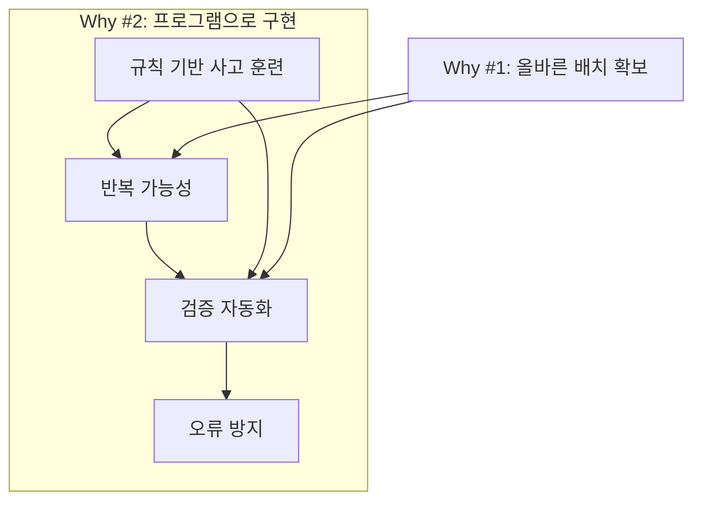
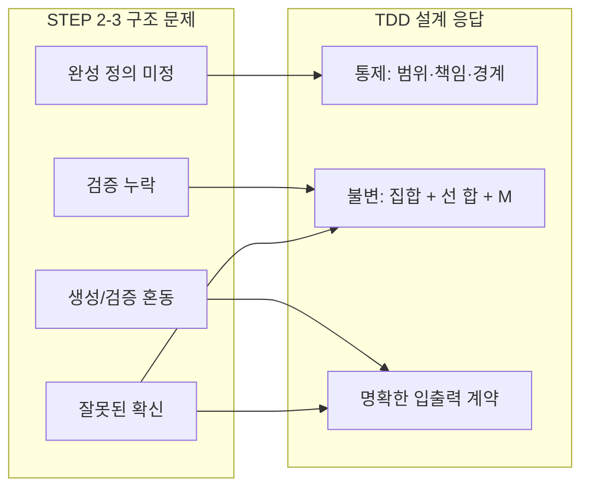

# 4x4 magic square problem observation
_Exported on 5/28/2026 at 14:04:42 GMT+9 from Cursor (3.5.33)_

---

**User**

당신은 문제 정의 전문가입니다.
나는 4x4 Magic Square 프로그램을 만들려고 합니다.
하지만 바로 설계하거나 구현하지 마십시오.
먼저 문제 인식 단계부터 진행하십시오.
--------------------------------------------
STEP 1 — Observation (관찰)
--------------------------------------------
다음 질문에 답하십시오:
1. 현재 우리가 해결하려는 상황은 무엇인가?
2. 왜 4x4 마방진 문제를 다루는가?
3. 이 문제는 어떤 학습 또는 시스템 설계 맥락에서 등장하는가?
“마방진을 만든다”는 표현 대신,상황을 관찰 관점으로 서술하십시오.


---

**Cursor**

프로젝트 맥락을 파악한 뒤, 관찰 관점에서 STEP 1에 답하겠습니다.


# STEP 1 — Observation (관찰)

워크스페이스(`MagicSquare_xx`)에는 아직 코드나 문서가 없습니다. 즉, **“무엇을 만들지”보다 “어떤 상황을 다룰지”를 먼저 정리하는 단계**에 있습니다. 아래는 그 전제에서의 관찰입니다.

---

## 1. 현재 우리가 해결하려는 상황은 무엇인가?

**한 사람(또는 한 팀)이, 4×4 격자에 1부터 16까지의 수를 한 번씩 배치했을 때 특정 합 조건을 만족하는 배치를 찾거나 검증·생성·탐색하려는 상황**입니다.

관찰로 풀면 다음과 같습니다.

- **입력/출력 관점**: “16개의 서로 다른 정수를 4행 4열에 놓는다”는 배치 문제가 있고, 그 결과가 **행·열·대각선 등 여러 선(line)의 합이 동일한지**를 판단하거나, 그런 배치를 **얻어내는** 과정이 필요합니다.
- **불확실성**: 아직 “프로그램이 사용자에게 무엇을 보여주는지”, “한 가지 해를 주는지·전부 나열하는지·검증만 하는지”는 정해지지 않았습니다. 다만 **4×4 + 1~16 + 합 일치**라는 제약이 문제의 중심에 있습니다.
- **맥락**: 폴더명과 대화로 보면, **학습·실습·작은 도구**를 염두에 둔 초기 프로젝트로 보이며, 아직 구현 전이라 **요구가 코드보다 먼저** 있는 상태입니다.

즉, 해결 대상은 “마방진 앱”이라기보다 **“제약을 만족하는 4×4 정수 배치를 다루는 상황”**에 가깝습니다.

---

## 2. 왜 4×4 마방진 문제를 다루는가?

관찰상 이유는 여러 층으로 겹칩니다.

| 관점 | 관찰 |
|------|------|
| **규모** | 3×3보다 제약·탐색·대칭이 풍부하고, 5×5 이상보다 **수작업·머리로 추적 가능한 한계**에 가깝습니다. |
| **수학·퍼즐** | 행·열·대각선 합, 중앙값, 패턴(예: 짝수 차수 마방진의 알려진 구성) 등 **“규칙이 있는 조합 문제”**의 전형입니다. |
| **컴퓨팅** | 백트래킹, 완전 탐색, 휴리스틱, 검증 함수, 출력 포맷 등 **알고리즘·구조화 연습**에 적합한 크기입니다. |
| **4×4 특수성** | 4는 짝수 차수라 **홀수 차수(예: 3×3)와 다른 구성·증명·알고리즘**이 자주 등장합니다. “일반 마방진”이 아니라 **짝수 4차**라는 하위 유형을 다루게 됩니다. |

**왜 4×4인가**에 대한 한 줄 관찰:  
*“작지만 비어 있지 않아, 사람이 이해하고 프로그램이 탐색·검증·생성을 시험하기에 부담이 적은 표준 퍼즐 크기이기 때문”*입니다.

---

## 3. 이 문제는 어떤 학습 또는 시스템 설계 맥락에서 등장하는가?

### 학습 맥락

- **알고리즘**: 상태 공간(16칸에 수 배치), 가지치기, 대칭으로 인한 중복 제거.
- **자료구조**: 2차원 배열, 행/열/대각선 인덱싱.
- **정확성**: “마방 상수”(magic constant) 계산, 부분 합으로 조기 실패 검증.
- **문제 분해**: 생성 vs 검증 vs “해가 몇 개인지” vs “하나만 출력”을 나누는 연습.

### 시스템 설계 맥락 (나중에 프로그램이 될 때)

- **도메인**: `Grid`, `Constraint`, `Solution`, `Validator` 같은 경계가 자연스럽게 생깁니다.
- **인터페이스**: CLI(한 번 출력) vs 대화형(입력 검증) vs API(배치 검사) — 아직 미정이지만 **같은 핵심 규칙**을 감쌉니다.
- **확장성**: 3×3, 5×5, n×n, 일반 마방진으로 확장할지 여부가 **초기에 4×4로 고정하는 이유**와 맞물립니다.

### “만든다” 대신 상황으로 서술하면

> *개발자는 4×4 격자에 1~16을 배치하는 수많은 경우 중, 여러 줄의 합이 같아지는 배치가 존재하는지·어떻게 얻는지·올바른지 확인하는 과정을, 반복 가능하고 설명 가능한 절차(프로그램)로 옮기려 한다. 지금은 그 절차의 목적(생성만? 검증만? 교육용 시각화?)이 아직 열린 상태이며, 문제 인식 단계에서 상황을 먼저 고정하려 한다.*

---

## 관찰 요약

| 질문 | 관찰 요약 |
|------|-----------|
| **상황** | 4×4, 1~16, 다중 선의 합 동일 — 배치·탐색·검증이 필요한 조합 제약 상황 |
| **이유** | 교육·실습에 적당한 크기; 짝수 차수의 대표 사례 |
| **맥락** | 알고리즘/구조화 학습 + (추후) 작은 도구·모듈 설계; 현재는 빈 프로젝트로 요구 정리 선행 |

---

다음 단계(STEP 2 — Problem framing / 이해관계자·목표·성공 기준 등)로 넘어가려면 말씀해 주세요. 그때도 설계·구현 없이 **문제 정의만** 이어가겠습니다.

---

**User**

--------------------------------------------
STEP 2 — Why #1
--------------------------------------------
Q: 왜 마방진을 완성해야 하는가?
A를 가정하여 답하고, 그 답에서 드러나는 불편함 또는 구조적 문제를 분석하십시오.


---

**Cursor**

# STEP 2 — Why #1

## 가정한 답 (A)

> **“4×4 격자에 1~16을 한 번씩 넣었을 때, 모든 행·열·대각선의 합이 같아지는 ‘올바른 배치’를 하나 확보해야, 그 배치가 진짜 마방진인지 검증·제출·비교할 수 있기 때문이다.”**

즉, **완성 = 제약을 만족하는 구체적인 해(solution)를 갖는 것**이고, 그 해가 있어야 “맞다/틀리다”를 말할 수 있다는 동기입니다.

---

## 이 답에서 드러나는 불편함

### 1. “완성”의 기준이 애매함

| 불편 | 내용 |
|------|------|
| **어떤 선까지?** | 행·열만인지, 주대각·부대각까지인지에 따라 “완성” 정의가 달라짐. |
| **하나 vs 전부** | “하나의 해”만 있으면 되는지, “모든 해”를 요구하는지에 따라 노력·시간이 크게 달라짐. |
| **완성 vs 검증** | 이미 배치가 주어졌을 때는 “만들기”가 아니라 “확인”만 하면 되는데, Why는 둘을 한 덩어리로 말하기 쉬움. |

→ **불편의 본질**: “완성해야 한다”는 말이 **성공 조건을 숨기고**, 나중에 요구사항이 바뀔 때마다 “완성”의 의미를 다시 협상하게 됨.

### 2. 완성이 목적인지, 수단인지 혼동

가정 A에서는 완성이 **검증·제출·비교를 위한 수단**입니다. 그런데 말은 종종 **완성 자체가 목표**처럼 들립니다.

- 학습 맥락: 완성 = 알고리즘·배치 연습의 **결과물**
- 과제 맥락: 완성 = 채점 가능한 **산출물**
- 퍼즐 맥락: 완성 = **만족감·종료 조건**

→ **불편**: 목적이 “해 하나 갖기”인지 “과정 이해하기”인지에 따라, **같은 Why라도 평가 기준과 실패 정의가 충돌**함 (예: 알고리즘은 이해했는데 해를 못 찾으면 실패인가?).

### 3. 4×4·짝수 차수에서의 “완성 난이도”

가정 A는 “해가 존재하니 완성 가능”을 전제합니다. 관찰상:

- 3×3은 규칙·대칭이 직관적이나, **4×4(짝수 차)는 구성 방식이 다르고** 수작업·머리로 완성하기 어렵습니다.
- 완성을 **수동·탐색·알고리즘** 중 무엇으로 할지 정하지 않으면, “왜 완성해야 하나”에 대한 답은 **“해야 하니까”**로 남기 쉽습니다.

→ **불편**: Why가 **인간의 인지 한계**와 **기계 탐색의 비용**을 구분하지 않아, “완성 못 함 = 노력 부족”으로 잘못 귀결될 수 있음.

### 4. 하나의 해로는 “마방진임”이 약하게 증명됨

가정 A: “하나 확보 → 검증 가능”.

- 한 배치를 **검증 통과**시키면 그 인스턴스는 맞지만, **“이 프로그램이 항상 맞는 해를 만든다”**는 별도 주장임.
- 우연히 맞는 배치, 부분 합만 맞는 배치, 대칭 복제 등 **“겉보기 완성”**과 **“정의상 완성”**이 갈릴 수 있음.

→ **불편**: Why가 **산출물 1개**에 묶여 있어, **신뢰(재현성·일반성)** 요구가 뒤늦게 튀어나옴.

---

## 구조적 문제 (Structural issues)

아래는 가정 A를 **문제 정의 구조**로 보면 생기는 결함입니다.

```
[동기]  올바른 배치가 있어야 검증·제출·비교 가능
           ↓
[압력]  "완성"을 빨리 달성해야 함
           ↓
[생략]  완성의 정의(어떤 선? 몇 개의 해?) · 수단(탐색 vs 공식) · 실패 허용
           ↓
[결과]  구현은 "16칸 채우기"에 치우치고, 도메인은 "합이 같은 선 집합"에 남음
```

### 구조 1 — 목표와 검증 기준의 분리 실패

- **목표**: 완성(해 확보)
- **진짜 제약**: 특정 선 집합의 합 동일

완성만 강조하면, 시스템은 **“16개 수 넣기”**에 최적화되고, **“magic constant·부분합·대칭”** 같은 검증 구조는 뒤로 밀립니다.  
→ **구조적 문제**: *Solution-first, Constraint-second* — 나중에 버그·오해의 원인.

### 구조 2 — 단일 해(Single solution) 가정

가정 A는 **“하나의 올바른 배치”**로 충분하다고 읽힙니다.

- 4×4 일반 마방진은 **해의 개수·대칭·동치류** 이슈가 있음.
- “하나만” vs “대표 하나” vs “전부”는 **제품·과제·연구**마다 다른 Why를 요구함.

→ **구조적 문제**: Why #1이 **탐색 공간의 크기와 대칭**을 다루지 않아, STEP 3 이후 요구가 폭발함.

### 구조 2′ — 완성 주체 불명확

| 주체 | 완성의 의미 |
|------|-------------|
| 사람 | 퍼즐 풀이, 이해 |
| 프로그램 | 자동 생성·탐색 |
| 외부 입력 | 사용자가 넣은 격자 검증 |

→ **구조적 문제**: **Who completes?** 가 없으면, 실패 시 책임(알고리즘 vs 입력 vs 정의 오류)을 나눌 수 없음.

### 구조 3 — “완성”이 종료 조건이지만 학습 목표는 과정

교육 맥락에서 Why #1이 “제출·검증”에 가깝으면:

- **성공** = 해 1개 출력
- **학습 목표** = 제약 추론, 가지치기, 짝수 차수 특성

→ **구조적 문제**: **Outcome-oriented Why**와 **Process-oriented 학습 목표**가 정렬되지 않음.  
완성만 보면 **브루트포스로도 Why는 충족**되어, 의도한 학습이 무력화될 수 있음.

### 구조 4 — 시간·비용이 Why에 없음

“완성해야 한다”는 답은 **언제까지·얼마나 빨리·얼마나 많이**를 말하지 않음.

- 4×4 완전 탐색은 작지만, **일반화(n×n)** 를 염두에 두면 Why #1이 **확장 불가능한 동기**가 됨.

→ **구조적 문제**: **Non-functional requirement(성능, 확장)** 가 Why 단계에서 배제되어, 나중에 “왜 이렇게 느려?”가 설계 논쟁이 됨.

---

## Why #1 정리 (가정 A 기준)

| 항목 | 내용 |
|------|------|
| **가정한 A** | 올바른 배치 1개가 있어야 검증·제출·비교가 가능하므로 “완성”이 필요하다 |
| **핵심 불편** | “완성”의 정의·범위·주체·개수가 열린 채로 압력만 생김 |
| **핵심 구조 문제** | 목표(해 확보)와 제약(합 동일 선 집합)·학습(과정)·신뢰(재현·정의)가 한 문장에 뭉개짐 |

---

## 다음 Why를 열기 위한 관찰 (구현·설계 아님)

가정 A를 유지한다면, STEP 3 전에 풀어야 할 **하위 질문**은 예를 들면 다음과 같습니다.

1. **완성** = 생성인가, 검증 통과인가, 둘 다인가?  
2. **누가** 완성하는가 (사람 / 프로그램 / 사용자 입력)?  
3. **몇 개의 해**가 필요한가 (1 / 대표 / 전체)?  
4. **어떤 선**까지 합이 같아야 하는가?

원하시면 **STEP 2 — Why #2**에서 가정 A를 바꾸거나 (“학습을 위해 완성해야 한다”, “과제 제출을 위해…”) 비교해 **Why 체인**을 이어가겠습니다.

---

**User**

--------------------------------------------
STEP 3 — Why #2
--------------------------------------------
Q: 왜 단순 계산이 아니라 프로그램으로 구현하는가?
다음 관점에서 답하십시오:
- 반복 가능성
- 검증 자동화
- 오류 방지
- 규칙 기반 사고 훈련
                                                                                                                                                                                                                                                                                                                                                                                                                                                                                                                                                                                                                                                                                                                                                                                                                                                                                                                                                                                                                                                                                                                                                                                                                                                                                                                                                                                                                                                                                                                                                                                                                                                                                                                                                                                                                                                                                                                                                                                                                                                                                                                                                                                                                                                                                                                                                                                                                                                                                                                                                                                                                                                                                                                                                                                                                                                                                                                                                                                                                                                                                                                                                                                                                                                                                                                                                                                                                                                                                                                                                                                                                                                                                                                                                                                                                                                                                                                                                                                                                                                                                                                                                                                                                                                                                                                                                                                                                                                                                                                                                                                                                                                                                                                                                                                                                                                                                                                                                                                                                                                                                                                                                                                                                                                                                                                                                                                                                                                                                                                                                                                                                                                                                                                                                                                                                                                                                                                                                                                                                                                                                                                                                                                                                                                                                                                                                                                                                                                                                          

---

**Cursor**

# STEP 3 — Why #2

## 질문

**왜 단순 계산(손계산·종이·계산기)이 아니라 프로그램으로 구현하는가?**

STEP 2에서 가정한 동기(올바른 배치를 확보해 검증·제출·비교)를 전제로, **“구현”은 아직 설계가 아니라 “계산을 절차로 고정한다”는 선택**으로 봅니다.

---

## 1. 반복 가능성 (Repeatability)

### 관찰

4×4 마방진 상황에서는 같은 질문이 **여러 번, 같은 조건으로** 반복됩니다.

- 다른 초기 배치·다른 후보 해에 대해 “합이 맞는가?”
- 알고리즘·수식을 바꾼 뒤 “결과가 이전과 같은가?”
- 학습·과제에서 “같은 입력 → 같은 판정”

손계산은 **실행자·시간·피로**에 따라 결과·과정이 달라질 수 있습니다. 프로그램은 **동일 입력에 대해 동일 절차·동일 출력**을 내도록 할 수 있습니다(의도가 그렇다면).

### Why #2에 대한 답

> **같은 규칙을 여러 번, 여러 케이스에 적용할 때, 사람마다·회마다 달라지는 “다시 풀기”를 없애고, 결과를 재현 가능하게 만들기 위해 프로그램을 쓴다.**

### 이 관점에서 드러나는 불편·구조

| 불편 | 구조적 함의 |
|------|-------------|
| “한 번만 맞으면 된다” vs “매번 같아야 한다” | 반복 가능성이 목표면 **입력·출력·버전**을 명시해야 함 |
| 손으로도 반복은 가능 | 프로그램의 가치는 **반복의 비용·속도·피로**가 클 때 커짐 |
| 4×4는 작아 손계산도 반복 가능 | Why #2가 약해지면 **“굳이 코드?”** 논쟁이 생김 → **케이스 수·변형(n×n, 전체 해)** 를 전제로 두는지 정해야 함 |

**구조적 문제**: 반복 가능성만으로는 **범위(몇 번, 어떤 입력)** 가 없으면, 프로그램은 “한 번 돌리는 계산기”로 축소됨.

---

## 2. 검증 자동화 (Verification Automation)

### 관찰

STEP 1·2에서 핵심 제약은 **“여러 선의 합이 동일한가”**였습니다. 이는:

- 4행 + 4열 + (정의에 따라) 대각선 → **여러 번의 덧셈·비교**
- 부분 배치 시 **조기 실패** 판단
- “마방 상수” \(M = 34\) (1~16, 4×4)와의 일치

손으로는 **누락(한 줄 안 봄)·오타·정의 혼동(부대각 포함 여부)** 이 검증 단계에서 자주 납니다.

### Why #2에 대한 답

> **배치가 주어지거나 생성되었을 때, ‘모든 필수 선의 합이 같은지’를 사람이 매번 다시 세지 않고, 규칙을 코드에 맡겨 일관되게 판정하기 위해 프로그램을 쓴다.**

### 이 관점에서 드러나는 불편·구조

| 불편 | 구조적 함의 |
|------|-------------|
| 검증 규칙이 바뀌면 손절차도 바뀜 | **검증 기준을 데이터/함수로 분리**하지 않으면 자동화 이점이 반감 |
| 생성과 검증이 섞임 | “만드는 프로그램”만 있고 검증이 약하면 **잘못된 해를 ‘완성’으로 출력** 가능 (STEP 2의 Solution-first 문제 재발) |
| 자동 ≠ 신뢰 | 버그 있는 검증기는 **잘못된 확신**을 줌 → “자동화했다”가 Why의 끝이 아님 |

**구조적 문제**: 검증 자동화는 **“무엇을 검증하는가”(선 집합, magic constant)** 가 먼저 고정되어야 하며, 이는 STEP 2에서 남긴 **“완성” 정의 미정**과 직결됨.

---

## 3. 오류 방지 (Error Prevention)

### 관찰

이 문제에서 오류는 대략 네 종류입니다.

1. **산술 오류** — 합 계산, 34와 비교
2. **제약 오류** — 1~16 중복·누락, 빈 칸
3. **절차 오류** — 검증 순서 누락, 대각선 하나 빠뜨림
4. **인지 오류** — “비슷해 보이는” 배치를 맞다고 착각

4×4는 격자가 작아 **한눈에 그럴듯**해 보이기 쉽고, 오류 방지 이점은 **탐색·생성** 단계에서 더 큽니다(중간 상태마다 부분 검증).

### Why #2에 대한 답

> **사람이 반복 검증·탐색을 할 때 생기는 계산 실수와 검사 누락을 줄이고, 제약 위반을 가능한 한 일찍, 기계적으로 걸러내기 위해 프로그램을 쓴다.**

### 이 관점에서 드러나는 불편·구조

| 불편 | 구조적 함의 |
|------|-------------|
| 프로그램도 버그는 “오류” | 오류 방지 Why는 **테스트·명세·검증기 이중화** 요구로 이어질 수 있음 |
| 과도한 신뢰 | 사용자가 출력만 믿고 **스스로 검증을 안 함** → 학습 목표와 충돌 가능 |
| 4×4만이면 손검증도 충분히 정확 가능 | 오류 방지만으로는 구현 동기가 약함 → **탐색·많은 후보·생성 과정**과 묶일 때 설득력 증가 |

**구조적 문제**: 오류 방지는 **Human error vs Software defect** 를 구분하지 않으면, “코드 짰으니 안전”이라는 잘못된 종료 조건이 생김.

---

## 4. 규칙 기반 사고 훈련 (Rule-based Thinking Training)

### 관찰

마방진은 자연어로는 “합이 같다” 한 줄이지만, 절차로 옮기면 **규칙의 층**이 있습니다.

- **불변식**: 1~16 각각 한 번, magic constant
- **구조 규칙**: 행/열/대각선 인덱스, 부분합
- **생성 규칙**(선택): 짝수 차수 구성, 대칭, 시프트
- **종료 규칙**: 모든 선 통과 시 수용

프로그램은 이런 규칙을 **명시적·실행 가능한 형태**로 드러내게 합니다. “단순 계산”은 종종 **결과 숫자만** 남기고 규칙 층위를 말로만 처리합니다.

### Why #2에 대한 답

> **암묵적으로만 알던 조건을 ‘if–then’, ‘모든 행에 대해’, ‘합 ≠ M이면 탈락’처럼 규칙으로 쪼개고, 그 규칙이 기계에서도 성립하는지 보며 사고를 훈련하기 위해 프로그램을 쓴다.**

### 이 관점에서 드러나는 불편·구조

| 불편 | 구조적 함의 |
|------|-------------|
| 목표가 “해 하나”면 훈련은 희석됨 | 브루트포스 한 파일도 Why #2(훈련)는 형식상 충족 → **과정·모듈·검증 분리**를 학습 목표로 명시해야 함 |
| 규칙과 구현이 뒤섞임 | “4×4만 돌아가면 됨”이 되면 **일반화·정의 명확화** 학습이 약해짐 |
| 훈련 vs 제출 | 과제 제출용 Why #1과 **규칙 사고용 Why #2** 가 동시에 있으면 평가 기준이 이중화됨 |

**구조적 문제**: 규칙 기반 사고는 **Non-functional + Pedagogical** 목표인데, 기능 요구(해 생성)와 같은 우선순위에 두면 **범위 creep**(문서화, n×n, UI)가 나기 쉬움.

---

## 네 관점 통합: Why #2 한 문장

> **4×4 배치·검증·(필요 시) 탐색을 같은 규칙으로 반복 적용하고, 합·중복·선 집합을 자동으로 판정하며, 사람의 계산·누락 오류를 줄이고, 동시에 제약을 실행 가능한 규칙으로 명시해 사고를 훈련하기 위해, 손계산 대신 프로그램이라는 절차에 고정한다.**

---

## 관점 간 관계 (구조 다이어그램)



- **반복 가능성** → 같은 검증을 많은 후보에 쓸 수 있게 함 → **검증 자동화**의 토대  
- **검증 자동화** → 반복 시 누락·오타 감소 → **오류 방지**  
- **규칙 기반 사고** → 검증·생성 규칙을 명시 → **반복 가능한 절차**로 응축  
- **오류 방지**만 강조하면 “계산기 + if문”으로 끝날 수 있음 → **훈련** 관점이 없으면 설계 동기가 빈약해짐  

---

## STEP 2와의 정합성 점검

| STEP 2에서 드러난 구조 문제 | Why #2가 어떻게 다루는가 / 남기는 갭 |
|---------------------------|--------------------------------------|
| “완성” 정의 미정 | 검증 자동화가 **선 집합·magic constant** 명시를 강제함 → 아직 답은 안 함, **다음 단계 과제** |
| 단일 해 vs 전체 해 | 반복 가능성·자동 검증이 **다수 해 탐색**을 정당화 |
| 완성 vs 과정 | 규칙 기반 사고는 **과정** 쪽; Why #1(산출물)과 **우선순위 협상** 필요 |
| Who completes? | 프로그램 = 생성·검증 주체 후보; **사용자 입력 검증**도 같은 Why #2로 설명 가능 |

---

## “단순 계산으로 충분한” 반례와 경계

프로그램이 **과잉**일 수 있는 경우(문제 정의상 기록해 둘 것):

- **한 번**, **이미 알려진 해 하나**를 종이에 적고 제출만 하면 됨  
- **검증 규칙**이 행·열만이고, 학습 목표가 규칙 명시가 아님  
- **실행 환경**이 없고, 목표가 순수 수학 증명  

반대로 프로그램이 **특히 설득력 있는** 경우:

- 후보 배치·부분 배치를 **많이** 시험  
- 생성 알고리즘·탐색을 **실험**  
- **재현·채점·회귀 테스트**가 필요  
- **규칙을 과제/포트폴리오 산출물**로 남겨야 함  

4×4 단일 해·1회 제출만이면 Why #2는 약하고, **STEP 1에서 본 “탐색·검증·반복”** 맥락과 맞물릴 때 강해집니다.

---

## STEP 3 요약

| 관점 | 프로그램을 쓰는 이유 (요지) | 남는 구조적 질문 |
|------|---------------------------|------------------|
| 반복 가능성 | 동일 규칙·동일 입력에 대한 재현 | 몇 번, 어떤 입력 범위? |
| 검증 자동화 | 다중 선·제약의 일관된 판정 | 어떤 선까지? 검증과 생성 분리? |
| 오류 방지 | 계산·누락·조기 실패 | 사람 오류 vs 소프트웨어 결함 |
| 규칙 기반 사고 | 제약의 명시·실행 가능화 | 학습 목표 vs 해 1개 제출 |

---

다음은 **STEP 4**(예: 이해관계자·성공 기준·범위 경계, 또는 Why #3)로 이어갈 수 있습니다. 원하시는 프레임(예: “사용자 스토리 없이 성공 조건만”, “4×4만 vs 확장”)을 알려주시면 그에 맞춰 문제 정의만 계속하겠습니다.

---

**User**

--------------------------------------------
STEP 4 — Why #3 (핵심 발견)
--------------------------------------------
Q: 왜 이 문제를 TDD 방식으로 설계하려 하는가?
- 무엇이 통제되어야 하는가?
- 어떤 불변 조건이 존재하는가?
- 왜 입력/출력이 명확해야 하는가?


---

**Cursor**

# STEP 4 — Why #3 (핵심 발견)

## 질문

**왜 이 문제를 TDD 방식으로 설계하려 하는가?**

STEP 1~3에서 정리한 맥락을 전제로 답합니다.

- **상황**: 4×4, 1~16, 여러 선의 합 동일 — 배치·검증·(필요 시) 생성·탐색  
- **Why #1**: “올바른 배치”를 확보해 판정·제출·비교하려 함 (완성 정의는 아직 열림)  
- **Why #2**: 반복·자동 검증·오류 방지·규칙을 실행 가능한 형태로 고정하려 프로그램을 씀  

TDD는 여기서 **“기능을 먼저 짜고 나중에 맞는지 본다”**가 아니라, **“무엇이 맞는지(통제·불변·입출력)를 먼저 고정한 뒤 절차를 채운다”**는 설계 순서에 가깝습니다.

---

## Why #3 — TDD를 선택하는 이유 (한 문장)

> **마방진은 겉보기엔 “16칸 채우기”지만 실제로는 검증 규칙·제약·불변식이 층을 이루고, STEP 2에서 드러난 ‘완성 정의 미정·검증 누락·잘못된 확신’을 막으려면, 행동(생성/탐색)보다 먼저 판정 기준을 테스트로 고정해야 하기 때문이다.**

즉 TDD는 이 문제에서 **“해를 만드는 기술”**보다 **“무엇을 옳다고 부를지”**를 통제하는 수단입니다.

---

## 1. 무엇이 통제되어야 하는가?

TDD 관점에서 “통제”는 **구현 세부가 아니라 판정과 경계**입니다.

### 1.1 통제 대상 맵

| 통제 대상 | 왜 통제해야 하는가 | 통제 실패 시 증상 |
|-----------|-------------------|------------------|
| **검증 범위** | 어떤 선(행·열·대각·부대각)까지 볼지 | “완성”인데 정의상 틀림, 또는 과도한 요구 |
| **도메인 제약** | 1~16 각 1회, 4×4, 정수 | 중복·누락·범위 밖을 통과 |
| **마방 상수 M** | 4×4, 1~16이면 M=34 | 합 비교 기준 혼동 |
| **생성 vs 검증 책임** | STEP 2의 Solution-first 방지 | 잘못된 격자를 “프로그램이 만들었으니 맞음” |
| **입력 형태** | 빈 칸, 잘못된 크기, null/문자열 | 예외·크래시·침묵 오류 |
| **출력 의미** | `true/false` vs 격자 vs 해 목록 vs 오류 코드 | 호출자가 결과를 오해 |
| **결정성** | Why #2의 반복 가능성 | 같은 입력인데 다른 판정 |
| **탐색 경계**(해당 시) | 1개만 vs 전부 vs 타임아웃 | 무한 루프·과도한 출력 |

### 1.2 TDD가 통제하는 “순서”

```text
[먼저 고정]  불변식 · 검증 규칙 · 입출력 계약
      ↓
[그다음]     부분 구현 (한 줄 합, 한 행, 중복 검사…)
      ↓
[마지막]     생성/탐색 (가장 변동 큼, 버그 많음)
```

**통제의 핵심**: “16칸을 채우는 코드”가 아니라 **“이 격자를 받으면 어떤 판정을 내릴지”**가 먼저.

### 1.3 STEP 2·3과의 연결

- Why #1의 **완성 정의 미정** → TDD는 **테스트 이름·케이스가 정의를 강제**  
- Why #2의 **검증 자동화** → 테스트가 **자동 검증의 명세**  
- Why #2의 **소프트웨어 결함** → 통제 없는 자동화는 **잘못된 확신** — 테스트가 그 방어막  

---

## 2. 어떤 불변 조건이 존재하는가?

불변 조건은 **어떤 연산(생성·스왑·탐색 한 단계)을 해도 깨지면 안 되는 성질**이거나, **최종 수용 시 반드시 참이어야 하는 성질**입니다.

### 2.1 항상 참이어야 하는 불변식 (정의상)

**격자 G가 “유효한 4×4 배치”일 때:**

1. **크기**: G는 4×4  
2. **값 집합**: 모든 원소 ∈ {1,2,…,16}, 서로 다름 (16개)  
3. **마방 상수**:  
   \(M = \frac{n(n^2+1)}{2} = \frac{4 \cdot 17}{2} = 34\)  
4. **선 합**(정의에 따라 명시):  
   - 각 **행** 합 = M (4개)  
   - 각 **열** 합 = M (4개)  
   - (포함 시) **주대각·부대각** 합 = M  

→ STEP 4 이전에 남아 있던 **“어떤 선까지?”** 는 불변 조건 목록에 **명시적으로 적어야** TDD가 의미 있음.

### 2.2 검증·탐색 중간 단계 불변 (알고리즘 설계 시)

생성/백트래킹을 할 경우, 테스트로 고정할 수 있는 **중간 불변** 예:

| 단계 | 불변 (예) |
|------|-----------|
| 부분 배치 | 이미 넣은 수는 1~16 중복 없음 |
| 조기 가지치기 | 어떤 **완성 가능한** 행/열이라도 현재 부분합이 M을 넘거나, 남은 칸으로 M 도달 불가 → 폐기 |
| 완료 시 | 위 2.1 전부 만족 |

**핵심 발견**: 마방진 불변은 **“합 = 34” 하나가 아니라**  
**집합 불변(1~16)** + **선형 불변(행·열·대각)** 의 **교차**입니다.  
한쪽만 테스트하면 **그럴듯한 오답**이 통과합니다 (예: 행만 맞고 열은 틀림).

### 2.3 대칭·동치 (통제 선택 사항)

4×4 마방진에는 **회전·반사·특정 치환** 등으로 동치인 해가 많을 수 있습니다.

- **불변**: “수학적으로 마방진이다”  
- **변할 수 있음**: “출력 해를 정규형(canonical) 하나로 줄인다”  

TDD 전에 정해야 할 통제:

- 테스트가 **동치 해를 다른 실패로 볼지**  
- “해 1개”가 **임의 1개**인지 **정규형 1개**인지  

→ 불변 조건과 **출력 정책**이 분리되어야 함.

### 2.4 불변 조건 계층 (설계용)

```text
L0  자료: 4×4, int, null 없음
L1  집합: {1..16} 순열
L2  스칼라: 모든 관측 선의 합 = 34
L3  정책: 출력 개수·순서·동치 처리
```

TDD는 보통 **L0 → L1 → L2 → L3** 순으로 테스트를 쌓을 때 **Why #3가 가장 분명**해집니다.

---

## 3. 왜 입력/출력이 명확해야 하는가?

TDD에서 테스트는 **작은 계약(contract)** 입니다. 입출력이 흐리면 **테스트가 명세가 아니라 구현 설명**이 됩니다.

### 3.1 입력이 명확해야 하는 이유

| 모호한 입력 | 문제 |
|-------------|------|
| “격자”가 2D 배열인지, 평탄화 16개인지, 문자열인지 | 같은 의미 다른 형태 → 테스트 중복·누락 |
| 빈 칸(0) 허용 여부 | 검증기 vs 생성기 책임 혼란 |
| 부분 격자 허용 여부 | `isValid` vs `isCompleteMagic` 구분 불가 |
| 잘못된 크기 3×4 | 예외인지 `false`인지 Result 타입인지 불명 |

**명확한 입력**이 있어야:

- **실패 케이스**를 먼저 적을 수 있음 (TDD의 red)  
- STEP 2의 **Who completes?** (사용자 입력 vs 프로그램 생성)를 함수 경계로 나눌 수 있음  

### 3.2 출력이 명확해야 하는 이유

| 모호한 출력 | 문제 |
|-------------|------|
| `boolean`만 반환 | “왜 틀렸는지” 학습·디버깅 불가; 잘못된 행을 모름 |
| 격자 반환 | “검증 통과”인지 “새로 생성”인지 혼동 |
| 해 목록 | 개수·중복·정렬 보장 없으면 반복 가능성(Why #2) 깨짐 |
| 예외 vs 오류 코드 | 호출자·테스트 기대 불일치 |

**명확한 출력**이 있어야:

- Why #1의 **“검증·제출·비교”** 가 자동화됨  
- Why #2의 **재현 가능성**이 “같은 입력 → 같은 출력 타입·값”으로 고정됨  
- 리팩터링 시 테스트가 **행위 보존**을 증명함  

### 3.3 이 문제에서 권장되는 “계약 분리” (아직 구현 아님)

문제 정의 단계에서만 제안:

| 책임 | 입력 (예) | 출력 (예) |
|------|-----------|-----------|
| **완전성/형식** | 4×4 int | `ok` / `InvalidGrid` |
| **집합 검사** | 4×4 int | `ok` / `Duplicate` / `OutOfRange` |
| **마방 검증** | 4×4 int + `LineSpec` | `ok` / `LineFailure(row,col,sum)` |
| **생성** | seed 또는 없음 | `Grid` 또는 `Optional<Grid>` |
| **탐색** | limit N | `List<Grid>` (순서·동치 정책 명시) |

→ **입출력 명확화 = TDD 가능한 경계 = STEP 2 구조 문제(생성/검증 뭉개짐) 해소**

### 3.4 “명확”의 최소 기준 (체크리스트)

- 타입·크기·값 범위가 문서/테스트에 있음  
- 실패 시 **한 가지** 관례 (예외 *또는* Result, 혼용 금지)  
- `validate`와 `generate`의 **반환 타입이 다르면 이름도 다름**  
- 동치·순서·개수에 대한 **보장 문장**이 있음 (없으면 “해 1개” 테스트 불가)  

---

## Why #3 통합: TDD가 이 문제에 맞는 구조적 이유



| Why #3 하위 질문 | 핵심 발견 |
|------------------|-----------|
| 무엇을 통제? | 판정 기준·책임 분리·탐색 경계·결정성 |
| 불변 조건? | 1~16 순열 + (정의된) 선 합 = 34 + 출력 정책 |
| 입출력 명확? | 테스트=명세; red-green이 **정의 협상**을 코드 전에 끝냄 |

---

## TDD를 **하지 않거나** 약해지는 경우 (경계)

문제 정의상 기록:

- 목표가 **종이에 해 하나**만이고 프로그램·회귀가 없음  
- “완성”이 **시각·UI**뿐이고 판정 규칙이 없음  
- 팀이 **LineSpec(대각 포함 여부)** 을 합의하지 않으려 함 → 테스트가 오히려 갈등을 고정  

반대로 TDD가 **특히 가치 있는** 경우 (지금 맥락):

- **검증 → 집합 → 선 합 → 생성** 순으로 쌓을 계획  
- Why #2의 **반복·자동 검증**이 실제 요구  
- 4×4를 **n×n로 확장**할 가능성 — 불변식 M(n)을 테스트로 먼저 고정  

---

## STEP 4 요약 (핵심 발견 한 줄)

> **4×4 마방진 프로그램의 진짜 난이도는 “16칸 채우기”가 아니라 “무엇을 마방진이라 부를지”이므로, TDD는 구현 기법이 아니라 완성 정의·검증 범위·입출력 계약을 통제하고, 집합·합·선 규칙이라는 불변을 계층적으로 고정하기 위한 설계 선택이다.**

---

다음 **STEP 5** 후보 (여전히 설계·코딩 없이):

- **성공 조건 / 실패 조건** 목록 (Given-When-Then 수준)  
- **LineSpec** 결정 (대각·부대각 포함 여부)  
- **최소 테스트 목록** (L0~L2만, 생성 전)  

원하시는 STEP 5 프레임을 지정해 주시면 그에 맞춰 이어가겠습니다.

---

**User**

--------------------------------------------
STEP 5 — 진짜 문제 정의
--------------------------------------------
다음을 작성하십시오:
1. 표면 문제 정의 (잘못된 정의)
2. 개선된 문제 정의 (정확한 정의)
3. 이 문제의 핵심 Invariant
4. 우리가 실제로 훈련하려는 사고 능력
−	구현 설계는 하지 마십시오.
−	코드 언급 금지.
−	알고리즘 설명 금지.
−	구조화된 Markdown으로 작성하십시오.
```


---

**Cursor**

# STEP 5 — 진짜 문제 정의

---

## 1. 표면 문제 정의 (잘못된 정의)

> **4×4 칸에 1부터 16까지 숫자를 넣어서, 행·열·대각선 합이 같은 마방진을 완성하는 프로그램을 만든다.**

### 이 정의가 잘못된 이유

| 함정 | 설명 |
|------|------|
| **행위 중심** | “칸을 채운다”“완성한다”에 초점이 가서, **무엇을 옳다고 판단할지**가 빠짐 |
| **성공 조건 누락** | “합이 같다”만 있고, **어떤 선**까지 포함하는지, **값이 1~16을 각각 한 번**인지 불명 |
| **산출물 혼동** | “맞는 격자 하나”인지, “모든 해”인지, “사용자가 넣은 격자 검사”인지 구분 없음 |
| **주체 혼동** | 사람이 푸는지, 프로그램이 만드는지, 외부 입력을 검증하는지 불명 |
| **도구 = 목표** | 프로그램·테스트·자동화가 **목적처럼** 읽히고, **규칙·판정·재현**이라는 본질이 가려짐 |
| **4×4 고정 착시** | “16칸 퍼즐”로만 보이면, **짝수 차수·제약 층위·동치** 같은 구조가 사라짐 |

### 표면 정의가 만드는 전형적 실패

- 겉보기 그럴듯한 배치를 “완성”으로 받아들임  
- 일부 선만 맞아도 통과시킴  
- 만들기와 검증을 한 덩어리로 다루어 **잘못된 확신** 발생  
- “돌아가면 끝”으로 **반복·비교·학습 목표**가 사라짐  

---

## 2. 개선된 문제 정의 (정확한 정의)

> **4×4 격자에 대한 배치가 주어졌을 때, 그 배치가 사전에 합의한 마방진 규칙(값 집합·선 집합·마방 상수)을 모두 만족하는지 판정할 수 있어야 하며, 필요하다면 같은 규칙을 만족하는 배치를 확보하거나 비교할 수 있도록, 판정 기준을 명시적·재현 가능·반복 적용 가능한 형태로 다루는 문제이다.**

### 정의를 구성하는 요소

| 요소 | 내용 |
|------|------|
| **대상** | 4×4 격자 위의 정수 배치 (한 칸에 하나의 값) |
| **값 집합 규칙** | 1 이상 16 이하의 서로 다른 정수가 정확히 16개 사용됨 |
| **마방 상수** | 이 크기·범위에서 기대되는 공통 합 목표값 (4×4, 1~16일 때 34) |
| **선 규칙** | **사전에 정한** 선의 집합(행, 열, 필요 시 대각 등)에 대해, 각 선 위 원소의 합이 마방 상수와 같음 |
| **핵심 활동** | (1) 주어진 배치에 대한 **판정**, (2) 동일 규칙으로의 **반복 적용**, (3) 규칙에 맞는 배치의 **확보·비교** — 범위는 목적에 따라 선택 |
| **품질 요구** | 같은 배치·같은 규칙이면 **같은 판정**; 판정 근거가 **누락·모호하지 않음** |
| **명시적 경계** | “완성”은 **규칙 전체 통과**를 의미하며, 부분 만족·겉모습 유사는 성공이 아님 |

### 개선 정의가 거부하는 것

- 칸을 채웠다는 사실만으로 성공으로 간주  
- 검증 범위 없이 “마방진 같다”는 말  
- 한 번 맞춘 예시만 기억하고 **규칙 일반화 없음**  
- 판정·확보·비교 중 무엇을 하는지 말하지 않은 채 “프로그램을 만든다”는 표현만 남기는 것  

### 개선 정의가 열어 두는 선택 (아직 결정 사항)

- 선 집합에 부대각 포함 여부  
- 확보할 배치의 개수(하나 / 대표 / 전부)  
- 배치를 **누가** 제시하는지(사람 / 절차 / 외부 입력)  

→ 이 선택들은 **구현 전에 명시**해야 하며, 개선 정의는 그 자리를 비워 두지 않고 **“사전 합의”**를 요구함.

---

## 3. 이 문제의 핵심 Invariant

불변 조건: **판정·비교·단계적 진행 어디에서든 깨지면 “마방진이다”라고 말할 수 없는 성질.**

### 3.1 구조 불변 (격자 자체)

| ID | 불변 조건 | 위반 시 의미 |
|----|-----------|--------------|
| **I-Shape** | 대상은 4행 4열의 유한 격자이다 | 대상 자체가 문제 범위 밖 |
| **I-Cell** | 각 칸에는 정확히 하나의 값이 있다 | 불완전·중복 칸 배치 |
| **I-Range** | 모든 값은 허용 범위 [1, 16] 안에 있다 | 정의 밖 값 사용 |
| **I-Set** | 16개 값은 서로 다르며, 집합 {1,…,16}과 일치한다 | 중복·누락·치환 오류 |

### 3.2 수치 불변 (마방진 판정)

| ID | 불변 조건 | 위반 시 의미 |
|----|-----------|--------------|
| **I-Constant** | 합의된 선 집합에서 기대하는 공통 합은 마방 상수(이 문제에서 34)이다 | 기준 혼동·잘못된 비교 |
| **I-Line-Row** | 각 행의 합 = 마방 상수 | 행 기준 실패 |
| **I-Line-Col** | 각 열의 합 = 마방 상수 | 열 기준 실패 |
| **I-Line-Diag** | *(선 집합에 포함한 경우만)* 주대각·부대각 등 정의된 대각의 합 = 마방 상수 | 대각 기준 실패 |

> **I-Line-*** 은 **선 집합 명세**에 종속된다. 명세 없이 “대각까지 당연”이라고 가정하면 불변 집합이 흔들린다.

### 3.3 판정·운용 불변 (문제를 다루는 방식)

| ID | 불변 조건 | 위반 시 의미 |
|----|-----------|--------------|
| **I-Judge-Complete** | “수용”은 **선택된 모든 불변(I-Shape ~ I-Line-*)** 을 동시에 만족할 때만 가능 | 부분 통과를 완성으로 오인 |
| **I-Judge-Repeat** | 동일 배치·동일 규칙 → 동일 수용/거부 | 재현성·비교 불가 |
| **I-Separation** | “판정 통과”와 “배치를 새로 확보함”은 개념적으로 구분된다 | 잘못된 출처·잘못된 확신 |
| **I-Equivalence** | *(해 비교·개수를 다룰 때)* 동치인 배치를 같은 것으로 볼지 여부가 정책으로 고정된다 | “해 하나” 주장이 모호해짐 |

### 3.4 불변 계층 (의존 관계)

```text
I-Shape → I-Cell → I-Range → I-Set
                              ↓
                    I-Constant (기준값)
                              ↓
              I-Line-* (명세된 선 집합 전부)
                              ↓
                    I-Judge-Complete
                              ↓
         I-Judge-Repeat · I-Separation · I-Equivalence
```

**핵심 발견:** 마방진의 본질 불변은 **“합이 같다” 한 줄이 아니라**, **집합 불변(I-Set)** 과 **선형 불변(I-Line-*)** 이 **동시에** 성립하는 것이다. 한 층만 만족하는 배치는 불변을 부분만 만족한 상태이다.

---

## 4. 우리가 실제로 훈련하려는 사고 능력

구현·절차가 아니라, 이 문제를 통해 길러지는 **인지·문제 정의 능력**이다.

### 4.1 규칙 층위화 (Layered rule thinking)

- 자연어 한 줄(“합이 같다”)을 **집합 규칙 / 선 규칙 / 수용 규칙**으로 나누어 생각한다.  
- 한 층만 맞는 경우와 **전 층이 맞는 경우**를 구분한다.

### 4.2 판정 우선 (Judgment-first mindset)

- “만들기”보다 **“이 배치를 무엇이라고 부를 수 있는가”** 를 먼저 고정한다.  
- 성공은 **규칙 전체 통과**이며, 그럴듯함·부분 만족은 성공이 아님을 인지한다.

### 4.3 명세적 사고 (Explicit specification)

- 검증 범위(어떤 선까지), 값 범위, 수용 조건을 **말하지 않으면 협상 불가**함을 안다.  
- 모호한 “완성”“맞다”를 **검사 가능한 조건**으로 바꾸려 한다.

### 4.4 불변식 사고 (Invariant reasoning)

- 어떤 조작·반복을 해도 **깨지면 안 되는 조건**을 식별한다.  
- 중간 상태와 최종 수용 상태에서 **각각 어떤 불변이 요구되는지** 구분한다.

### 4.5 계약·경계 사고 (Boundary and responsibility)

- 입력이 무엇인지(완전한 격자인지, 부분인지), 출력이 무엇인지(수용/거부, 이유, 배치)를 구분한다.  
- **판정**, **확보**, **비교**의 책임이 섞이지 않게 나눈다.

### 4.6 재현·반복에 대한 태도 (Repeatable reasoning)

- 같은 질문을 여러 번, 여러 배치에 대해 **동일 기준**으로 적용할 수 있어야 한다고 본다.  
- 한 번의 운이나 기억에 의존하지 않고 **기준을 밖으로 빼는 것**의 가치를 이해한다.

### 4.7 오류·확신 구분 (Calibration of confidence)

- 사람의 계산·누락 오류와 **기준 자체의 오류·모호함**을 구분한다.  
- 자동화·도구 사용 후에도 **“규칙이 맞게 정의되었는가”** 를 의심할 수 있다.

### 4.8 훈련 목표가 **아닌** 것 (경계)

| 이 문제로 주 목표로 삼지 않음 | 이유 |
|------------------------------|------|
| 특정 배치 암기 | 규칙 일반화와 무관 |
| 손계산 속도만 | 판정 구조·불변 이해와 무관 |
| 도구 사용 자체 | 수단이 목표가 되면 STEP 2~3의 구조 문제 재발 |

---

## STEP 5 통합 요약

| 항목 | 한 줄 |
|------|--------|
| **표면 문제** | 16칸 채워 합 맞추기 |
| **진짜 문제** | 합의된 규칙으로 4×4 배치를 **판정·반복·비교**할 수 있게 기준을 명시·고정하는 것 |
| **핵심 Invariant** | {1…16} 집합 + 명세된 선들의 합 = 마방 상수 + 완전 판정·재현·책임 분리 |
| **훈련하는 사고** | 규칙 층위화, 판정 우선, 명세·불변·경계·재현·확신 보정 |

---

## 다음 단계 (문제 정의 이후, 아직 설계 아님)

문제 정의를 **닫기** 위해 남은 결정만 나열한다.

1. **선 집합 명세** — 대각·부대각 포함 여부  
2. **활동 범위** — 판정만 / 확보까지 / 비교·개수까지  
3. **동치 정책** — 같은 해를 어떻게 취급할지  
4. **성공의 최소 증거** — 어떤 불변 세트 통과를 “완료”로 부를지  

원하시면 STEP 6에서 위 네 가지를 **결정 질문 + 선택지** 형태로만 정리하겠습니다. (여전히 구현·코드·절차 설명 없이)

---

**User**

"현재까지의 프롬프트를 대화형 프롬프트로 Prompting 폴더에 Export transcript 해줘"

---

**Cursor**

대화 내용을 대화형 프롬프트 형식으로 정리해 `Prompting` 폴더에보냅니다.


대화형 프롬프트 트랜스크립트를 `Prompting` 폴더에 작성합니다.


STEP 5 전체 응답을 별도 파일로 보존합니다.


`Prompting` 폴더에 STEP 1~5 대화를 **대화형 프롬프트·트랜스크립트** 형태로보냈습니다.

## 생성된 파일

| 파일 | 용도 |
|------|------|
| [Prompting/README.md](c:\DEV\MagicSquare_xx\Prompting\README.md) | 폴더 안내·재사용 방법 |
| [4x4-magic-square-problem-definition-interactive.md](c:\DEV\MagicSquare_xx\Prompting\4x4-magic-square-problem-definition-interactive.md) | **메인** — System 역할 + Turn 1~5 (User/Assistant) + STEP 6 Continuation |
| [4x4-magic-square-prompts-chain.md](c:\DEV\MagicSquare_xx\Prompting\4x4-magic-square-prompts-chain.md) | User 프롬프트만 순서대로 복사용 |
| [4x4-magic-square-session-summary.md](c:\DEV\MagicSquare_xx\Prompting\4x4-magic-square-session-summary.md) | STEP 1~5 요약(새 채팅 컨텍스트 주입용) |
| [4x4-magic-square-step5-full-response.md](c:\DEV\MagicSquare_xx\Prompting\4x4-magic-square-step5-full-response.md) | STEP 5 Assistant **원문 전체** |

## 재사용 예

- **이어하기**: `interactive` 하단 **Continuation — STEP 6** 블록을 새 채팅에 붙이기 (앞에 `session-summary` 붙이면 컨텍스트 유지에 유리).
- **처음부터**: `prompts-chain`의 STEP 0~5를 순서대로 실행.
- **STEP 5만 참고**: `step5-full-response.md`.

`interactive`의 Turn 1~4 Assistant는 가독성을 위해 요약했고, STEP 5는 전문을 별도 파일에 두었습니다. STEP 1~4도 원문 전체가 필요하면 알려 주시면 같은 방식으로 추가하겠습니다.

---

**User**

지금까지 작업한 내용을 Report 폴더에 보고서로 내보내줘

---

**Cursor**

지금까지의 문제 정의·프롬프트 작업을 정리해 `Report` 폴더에 보고서로 작성합니다.


`Report` 폴더에 지금까지 작업 내용을 종합 보고서로보냈습니다.

## 생성된 파일

| 파일 | 설명 |
|------|------|
| [Report/2026-05-28-Problem-Definition-Report.md](c:\DEV\MagicSquare_xx\Report\2026-05-28-Problem-Definition-Report.md) | **종합 보고서** (STEP 1~5, Why 체인, Invariant, 미결정, 산출물, 리스크, 결론) |
| [Report/README.md](c:\DEV\MagicSquare_xx\Report\README.md) | Report 폴더 안내 |

## 보고서 구성 (10장)

1. **요약** — 진짜 문제·핵심 발견 4줄  
2. **프로젝트 배경** — 워크스페이스 상태, 방법론  
3. **작업 수행 내역** — STEP 표, Prompting Export  
4. **STEP별 상세** — 1~5 전체 결과  
5. **Why 체인 통합** — 다이어그램·한 줄 정리  
6. **미결정 사항** — STEP 6 후보 4항  
7. **산출물 목록** — `Report/`, `Prompting/`, 미생성 항목  
8. **리스크 및 주의** — 표면 정의 회귀, 선 집합 미정 등  
9. **결론 및 권고**  
10. **부록** — STEP 5 표, STEP 6 참조, 문서 이력  

`Prompting/`에 있는 트랜스크립트·요약은 보고서에서 참조로 연결해 두었고, STEP 5 원문은 `Prompting/4x4-magic-square-step5-full-response.md`를 가리키도록 했습니다.

STEP 6(미결정 4항 결정)까지 보고서에 포함하려면 말씀해 주세요.

