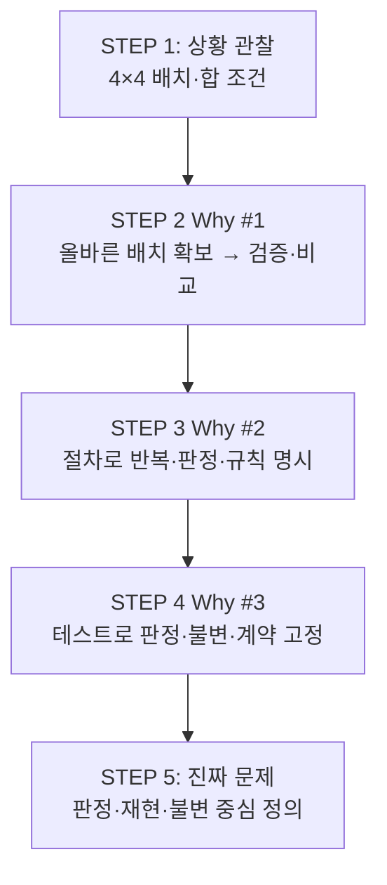

# 4×4 Magic Square 프로젝트 — 문제 정의 작업 보고서

| 항목 | 내용 |
|------|------|
| **프로젝트** | MagicSquare_xx |
| **보고 일자** | 2026-05-28 |
| **작업 범위** | 문제 인식 STEP 1 ~ 진짜 문제 정의 STEP 5, Prompting Export |
| **미포함** | 설계, 구현, 테스트 코드, 알고리즘 상세 |

---

## 1. 요약 (Executive Summary)

본 세션은 **4×4 Magic Square 프로그램**을 만들기 전에, 구현이 아닌 **문제 정의**에만 집중하였다. 다섯 단계(관찰 → Why #1~#3 → 진짜 문제 정의)를 거쳐 다음을 확정·정리하였다.

1. **다루는 상황**은 “16칸 퍼즐 앱”이 아니라, **4×4 격자 배치가 합의된 마방진 규칙을 만족하는지 판정·반복·비교**하는 문제이다.
2. **표면 목표**(칸 채우기·완성)와 **실제 제약**(값 집합·선 집합·마방 상수)이 어긋나면 Solution-first 오류가 발생한다.
3. **프로그램·TDD**는 수단이며, 목적은 **재현 가능한 판정 기준**과 **명시적 불변 조건**을 고정하는 것이다.
4. **구현 전에 반드시 결정**해야 할 네 가지(선 집합, 활동 범위, 동치 정책, 성공 증거)가 남아 있다.

동일 내용의 재사용 자료는 `Prompting/` 폴더에 대화형 트랜스크립트로 Export 되어 있다.

---

## 2. 프로젝트 배경

### 2.1 목표(장기)

4×4 크기의 마방진을 다루는 프로그램을 개발한다. 값은 1부터 16까지 각각 한 번씩 사용한다.

### 2.2 현재 워크스페이스 상태

| 항목 | 상태 |
|------|------|
| 소스 코드 | 없음 |
| 테스트 | 없음 |
| 문서 | `Prompting/`, `Report/` (본 세션에서 생성) |
| 단계 | **요구·문제 정의 선행** |

### 2.3 세션 방법론

| 원칙 | 적용 |
|------|------|
| 문제 정의 전문가 역할 | 설계·구현 지시 금지 |
| 단계적 Why | 관찰 → 완성 동기 → 프로그램 → TDD |
| STEP 5 추가 제약 | 코드·알고리즘·구현 설계 언급 금지 |
| 산출물 보존 | `Prompting/` Export 후 본 `Report/` 작성 |

---

## 3. 작업 수행 내역

### 3.1 단계별 수행 요약

| STEP | 제목 | 핵심 질문 | 주요 산출 |
|------|------|-----------|-----------|
| 1 | Observation | 무엇을 다루는가? | 상황·4×4 선택 이유·학습/설계 맥락 |
| 2 | Why #1 | 왜 완성해야 하는가? | 가정 A, 불편함, 구조적 문제 4종 |
| 3 | Why #2 | 왜 프로그램인가? | 반복·자동 검증·오류 방지·규칙 사고 |
| 4 | Why #3 | 왜 TDD인가? | 통제 대상, 불변 계층, 입출력 명확성 |
| 5 | 진짜 문제 정의 | 무엇이 진짜 문제인가? | 표면/개선 정의, Invariant, 훈련 사고 |

### 3.2 병행 작업 — Prompting Export

| 일자 | 작업 | 결과물 |
|------|------|--------|
| 2026-05-28 | 대화형 프롬프트·트랜스크립트 Export | `Prompting/` 하위 5개 파일 |

---

## 4. STEP별 상세 결과

### 4.1 STEP 1 — Observation (관찰)

#### 해결하려는 상황

4×4 격자에 1~16을 한 번씩 배치할 때, **여러 선(행·열·대각 등)의 합이 동일한지** 판단하거나, 그런 배치를 **얻어내는** 상황이다. 아직 “한 해 / 전체 해 / 검증만”은 정해지지 않았다.

#### 4×4를 다루는 이유

- 3×3보다 제약·대칭이 풍부하고, 5×5 이상보다 **추적·학습에 적당한 규모**
- **짝수 차수(4)** — 홀수 차 마방진과 다른 하위 유형
- 알고리즘·자료구조·정확성·문제 분해 연습에 적합

#### 맥락

- **학습**: 상태 공간, 가지치기, 마방 상수, 생성 vs 검증 분해
- **시스템(추후)**: 격자·제약·검증 경계; CLI/대화형/API는 미정

**관찰 한 줄**: “마방진을 만든다”가 아니라 **제약을 만족하는 4×4 정수 배치를 다루는 상황**.

---

### 4.2 STEP 2 — Why #1 (왜 완성하는가)

#### 가정한 답 (A)

> 올바른 배치 1개를 확보해야 검증·제출·비교가 가능하므로 “완성”이 필요하다.

#### 드러난 불편함

| # | 불편 | 요지 |
|---|------|------|
| 1 | 완성 기준 애매 | 선 범위, 해 개수, 완성 vs 검증 혼동 |
| 2 | 목적 vs 수단 | 완성은 수단인데 목표처럼 읽힘 |
| 3 | 4×4 난이도 | 짝수 차, 수작업 어려움, 수단 미정 |
| 4 | 해 1개의 약한 증명 | 인스턴스 통과 ≠ 항상 옳은 생성 |

#### 구조적 문제

```text
[동기] 올바른 배치 → 검증·제출·비교
   ↓
[압력] 완성을 빨리
   ↓
[생략] 정의·주체·실패 허용
   ↓
[결과] 16칸 채우기에 치우침 (Solution-first, Constraint-second)
```

추가: **단일 해 가정**, **Who completes?** 미정, **과정 vs 산출물** 충돌, **비기능(성능·확장)** 부재.

#### STEP 3 전에 풀어야 할 하위 질문

1. 완성 = 생성 / 검증 / 둘 다?  
2. 누가 완성하는가?  
3. 해 몇 개가 필요한가?  
4. 어떤 선까지 합이 같아야 하는가?

---

### 4.3 STEP 3 — Why #2 (왜 프로그램인가)

| 관점 | 프로그램을 쓰는 이유 | 남는 질문 |
|------|---------------------|-----------|
| **반복 가능성** | 동일 규칙·입력 → 동일 판정 | 몇 번, 어떤 입력 범위? |
| **검증 자동화** | 다중 선·제약의 일관 판정 | 선 집합? 생성/검증 분리? |
| **오류 방지** | 계산·누락·조기 실패 | 사람 오류 vs SW 결함 |
| **규칙 기반 사고** | 제약을 명시·실행 가능 규칙으로 | 학습 vs 해 1개 제출 |

**통합**: 손계산 대신 **절차에 고정**하여 반복·판정·규칙 명시를 가능하게 한다.

**경계**: 4×4·해 1개·1회 제출만이면 프로그램 동기가 약함. 다수 후보·탐색·회귀가 있을 때 강함.

---

### 4.4 STEP 4 — Why #3 (왜 TDD인가)

#### TDD의 역할(본 문제에서)

구현 기법이 아니라 **판정 기준·불변·입출력 계약을 먼저 고정**하는 설계 순서.

#### 통제되어야 하는 대상

| 통제 대상 | 통제 실패 시 |
|-----------|--------------|
| 검증 범위(선 집합) | 정의상 틀림 또는 과도 요구 |
| 도메인(1~16, 4×4) | 중복·누락 통과 |
| 마방 상수 (34) | 합 비교 기준 혼동 |
| 생성 vs 검증 | 잘못된 격자를 맞다고 함 |
| 입출력 의미 | 오해·침묵 오류 |
| 결정성 | 같은 입력 다른 판정 |
| 탐색 경계 | 무한·과다 출력 |

**권장 순서**: 불변·검증·계약 → 부분 구현 → 생성/탐색.

#### 불변 조건 계층

```text
L0  형식 (4×4, 값 존재)
L1  집합 {1..16} 각 1회
L2  명세된 선의 합 = 마방 상수 (34)
L3  출력·동치 정책
```

**핵심 발견**: 난이도는 “16칸 채우기”가 아니라 **“무엇을 마방진이라 부를지”**.

#### 입출력 명확성

테스트 = **계약**. 모호하면 명세가 아니라 구현 설명이 된다. 판정·확보·비교의 **책임 분리**가 TDD 가능 경계이다.

---

### 4.5 STEP 5 — 진짜 문제 정의

#### 1) 표면 문제 정의 (잘못된 정의)

> 4×4 칸에 1~16을 넣어 행·열·대각선 합이 같은 마방진을 **완성하는 프로그램**을 만든다.

**함정**: 행위 중심, 성공 조건·선·값 집합 누락, 산출물·주체 혼동, 도구=목표, 16칸 퍼즐 착시.

#### 2) 개선된 문제 정의 (정확한 정의)

> 4×4 격자에 대한 배치가 **사전 합의한 마방진 규칙**(값 집합·선 집합·마방 상수)을 **모두** 만족하는지 **판정**할 수 있어야 하며, 필요 시 같은 규칙으로 **반복·확보·비교**할 수 있도록, 판정 기준을 **명시적·재현 가능·반복 적용 가능**하게 다루는 문제이다.

| 구성 요소 | 내용 |
|-----------|------|
| 대상 | 4×4 격자, 칸당 하나의 정수 |
| 값 집합 | 1~16, 서로 다름, 16개 |
| 마방 상수 | 4×4, 1~16일 때 **34** |
| 선 규칙 | 사전 정의 선마다 합 = 마방 상수 |
| 활동 | 판정 · 반복 적용 · (선택) 확보·비교 |
| 품질 | 동일 입력·규칙 → 동일 판정 |
| 경계 | 부분 만족·겉모습 유사 ≠ 성공 |

#### 3) 핵심 Invariant

**구조**

| ID | 불변 |
|----|------|
| I-Shape | 4×4 유한 격자 |
| I-Cell | 칸당 값 하나 |
| I-Range | 값 ∈ [1, 16] |
| I-Set | {1,…,16}과 일치 (중복·누락 없음) |

**수치** (선 집합은 **사전 명세**)

| ID | 불변 |
|----|------|
| I-Constant | 공통 합 = 34 |
| I-Line-Row | 각 행 합 = 34 |
| I-Line-Col | 각 열 합 = 34 |
| I-Line-Diag | 명세 시 대각 합 = 34 |

**운용**

| ID | 불변 |
|----|------|
| I-Judge-Complete | 수용 = 선택된 모든 불변 동시 만족 |
| I-Judge-Repeat | 동일 배치·규칙 → 동일 판정 |
| I-Separation | 판정 통과 ≠ 새 배치 확보 |
| I-Equivalence | 동치 해 처리 정책 고정 (해 비교 시) |

**의존 관계**

```text
I-Shape → I-Cell → I-Range → I-Set → I-Constant → I-Line-* → I-Judge-Complete
                                                              → Repeat / Separation / Equivalence
```

**발견**: **집합 불변(I-Set)** 과 **선형 불변(I-Line-*)** 은 동시에 성립해야 한다.

#### 4) 훈련하려는 사고 능력

| # | 능력 |
|---|------|
| 1 | 규칙 층위화 |
| 2 | 판정 우선 |
| 3 | 명세적 사고 |
| 4 | 불변식 사고 |
| 5 | 계약·경계 사고 |
| 6 | 재현·반복 태도 |
| 7 | 오류·확신 구분 |

**주 목표로 삼지 않음**: 특정 배치 암기, 손계산 속도만, 도구 사용 자체.

---

## 5. Why 체인 통합



| 단계 | 한 줄 |
|------|--------|
| 관찰 | 제약 만족 배치를 다루는 상황 |
| Why #1 | 완성(해)이 있어야 판단·제출 가능 — 정의는 아직 열림 |
| Why #2 | 손계산 대신 재현 가능한 절차 |
| Why #3 | TDD = “무엇을 마방진이라 부를지” 통제 |
| 진짜 문제 | 규칙으로 판정·반복·비교; 16칸 채우기는 수단일 뿐 |

---

## 6. 미결정 사항 (Open Decisions)

구현·설계 착수 전 **사전 합의**가 필요한 항목이다.

| # | 결정 항목 | 선택지(예) | 비고 |
|---|-----------|------------|------|
| 1 | **선 집합 명세** | 행+열만 / +주대각 / +부대각 | I-Line-Diag 범위 결정 |
| 2 | **활동 범위** | 판정만 / 확보까지 / 비교·개수 | 제품·학습 목표에 따름 |
| 3 | **동치 정책** | 동치 무시 / 정규형 1개 / 전체 열거 | “해 1개” 의미 고정 |
| 4 | **성공 최소 증거** | 어떤 Invariant 세트 통과 = 완료 | I-Judge-Complete 구체화 |

**권장 다음 단계**: STEP 6 — 위 네 항목에 대해 **결정 질문 + 선택지 + 권장 기본값** 정리 (여전히 구현 없음).

---

## 7. 산출물 목록 (Deliverables)

### 7.1 Report (본 문서)

| 경로 | 설명 |
|------|------|
| `Report/2026-05-28-Problem-Definition-Report.md` | 본 종합 보고서 |
| `Report/README.md` | Report 폴더 안내 |

### 7.2 Prompting (Export)

| 경로 | 설명 |
|------|------|
| `Prompting/README.md` | Export 안내·재사용법 |
| `Prompting/4x4-magic-square-problem-definition-interactive.md` | 대화형 트랜스크립트 + STEP 6 템플릿 |
| `Prompting/4x4-magic-square-prompts-chain.md` | User 프롬프트 체인 |
| `Prompting/4x4-magic-square-session-summary.md` | STEP 1~5 요약 |
| `Prompting/4x4-magic-square-step5-full-response.md` | STEP 5 응답 원문 |

### 7.3 미생성

| 항목 | 상태 |
|------|------|
| 소스 코드 | 없음 |
| 테스트 | 없음 |
| 실행 가능 프로그램 | 없음 |

---

## 8. 리스크 및 주의사항

| 리스크 | 설명 | 완화 |
|--------|------|------|
| 표면 정의로 회귀 | “완성 프로그램” 표현 재사용 | 개선 정의·Invariant를 요구 명세의 기준으로 사용 |
| 선 집합 미정 | 대각 포함 여부에 따라 판정 결과 상이 | STEP 6에서 LineSpec 확정 |
| 도구 과신 | 자동화·TDD 후 검증 누락 | I-Judge-Complete, Separation 유지 |
| 범위 확장 | n×n, UI 조기 도입 | 4×4·판정 우선 범위 고정 후 확장 |
| 학습 목표 희석 | 해 1개만 출력하고 규칙 학습 생략 | 훈련 사고 7항을 평가 기준에 반영 |

---

## 9. 결론 및 권고

1. **진짜 문제**는 마방진 “완성”이 아니라, **합의된 규칙에 따른 판정·재현·비교**이다.  
2. **구현 착수 전** Open Decisions 네 가지를 닫을 것(STEP 6).  
3. 이후 단계(TDD·구현)에서는 **검증 → 집합 → 선 합 → 생성/탐색** 순서를 권고한다(STEP 4).  
4. `Prompting/` 자료로 동일 문제 정의 세션을 **재현·이어하기**할 수 있다.

---

## 10. 부록

### A. STEP 5 통합 표 (참조)

| 항목 | 한 줄 |
|------|--------|
| 표면 문제 | 16칸 채워 합 맞추기 |
| 진짜 문제 | 규칙으로 판정·반복·비교 가능한 기준 고정 |
| 핵심 Invariant | {1…16} + 선 합 = 34 + 완전 판정·재현·분리 |
| 훈련 사고 | 층위화·판정 우선·명세·불변·경계·재현·확신 |

### B. STEP 6 Continuation 프롬프트 (요약)

`Prompting/4x4-magic-square-problem-definition-interactive.md` 하단 **Continuation** 섹션 참조.

### C. 문서 이력

| 버전 | 일자 | 내용 |
|------|------|------|
| 1.0 | 2026-05-28 | 최초 작성 — STEP 1~5 및 Prompting Export 반영 |

---

*본 보고서는 문제 정의 단계 산출물이며, 설계·구현 명세를 대체하지 않는다.*
