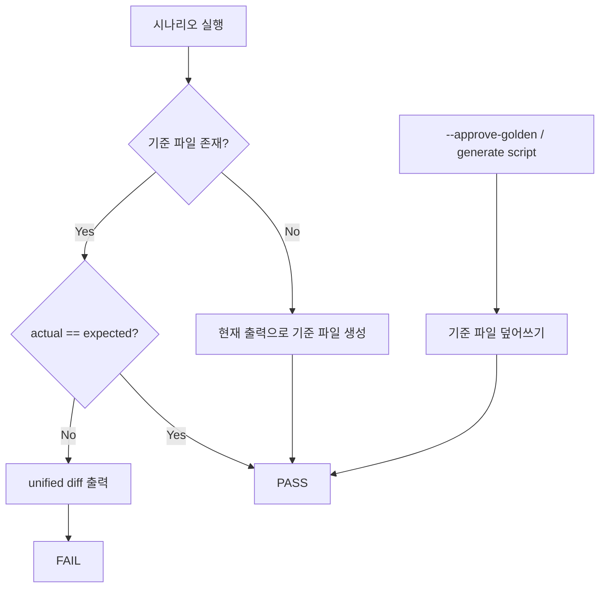

# Golden Master (Approval) 테스트 설계 — GM-1 Magic Square

| 항목 | 내용 |
|------|------|
| **Test ID** | GM-1 |
| **유형** | 회귀 테스트 (Approval / Golden Master) |
| **기준 파일** | `tests/golden_master_expected.txt` |
| **실행** | `pytest tests/test_gm_01_magic_square_golden_master.py` |
| **갱신** | `pytest --approve-golden` 또는 `python scripts/generate_golden_master.py` |
| **작성일** | 2026-05-24 |

---

## 1. 목적

Magic Square Solver의 **실제 Boundary 출력**을 스냅샷으로 고정하여, 이후 리팩터링·기능 추가 시 **의도치 않은 출력 변경**을 자동으로 감지한다.

- Logic Track / UI Track과 별도로 **End-to-End Boundary 회귀** 레이어를 제공한다.
- RED/GREEN TDD와 병행 가능 — 구현 변경 후 `pytest` 한 번으로 전 시나리오 출력을 검증한다.

---

## 2. Approve 패턴



| 상태 | 동작 | 결과 |
|------|------|------|
| 기준 파일 **없음** | `auto_create=True` → 현재 출력 저장 | **PASS** (`created`) |
| 기준 파일 **있음**, 일치 | 비교만 수행 | **PASS** (`matched`) |
| 기준 파일 **있음**, 불일치 | `difflib.unified_diff` 후 `AssertionError` | **FAIL** |
| `--approve-golden` | 기준 파일 덮어쓰기 | **PASS** (`updated`) |

---

## 3. 출력 캡처 전략

**캡처 대상:** `UIBoundary.solve(grid)` Result DTO 직렬화 (stdout 아님)

| 결과 유형 | 직렬화 형식 | 근거 |
|-----------|-------------|------|
| `SuccessResponse` | `Output:\n[r1,c1,n1,r2,c2,n2]` | PRD §12.2 `int[6]`, 쉼표 구분·공백 없음 |
| `FailureResponse` | `Error:\n{code}` | PRD §12.3 기계 판독 코드 (E002, E005 등) |
| `UnsolvableDomainError` | `Error:\nE006` | Domain 예외 → Boundary E006 계약 (PRD §12.3) |

> **참고:** 현재 `UIBoundary`는 `UnsolvableDomainError`를 아직 `FailureResponse(E006)`으로 매핑하지 않는다. Golden Master 캡처 레이어에서 **PRD 계약 코드 E006**으로 직렬화하여, E006 매핑 구현 후에도 기대값이 안정적으로 유지되도록 한다.

---

## 4. 시나리오 목록

| Section | 격자 | Domain 의미 | 기대 출력 |
|---------|------|-------------|-----------|
| `normal_success` | G2 (Report/05 §9) | Step B-only 성공 | `[3,3,1,4,4,6]` |
| `reverse_success` | G1 (Report/02) | 대체 성공 경로 | `[2,2,7,3,3,10]` |
| `invalid_blank_count` | G0 (완전 격자) | 빈칸 0개 | `E002` |
| `duplicate_number` | U-IN-08 | non-zero 중복 | `E005` |
| `no_valid_solution` | G3 (Report/02) | Step A·B 모두 실패 | `E006` |

시나리오 정의 SSOT: `tests/golden_master_scenarios.py`

---

## 5. 기준 파일 구조

```
[normal_success]
Input:
16 2 3 13
5 11 10 8
9 7 0 12
4 14 15 0
Output:
[3,3,1,4,4,6]

________________________________________

[reverse_success]
...
```

- **Section 헤더:** `[scenario_name]` — `golden_master_scenarios.py`의 `name`과 1:1 대응
- **구분선:** `________________________________________` (40 underscores)
- **인코딩:** UTF-8, 줄바꿈 LF

---

## 6. 파일 구성

| 파일 | 역할 |
|------|------|
| `tests/golden_master_expected.txt` | 버전 관리 대상 기준 출력 |
| `tests/golden_master_scenarios.py` | 입력 격자·시나리오 SSOT |
| `tests/golden_master_support.py` | 캡처·직렬화·approve 비교 |
| `tests/golden_master_conftest.py` | `--approve-golden` pytest 옵션 |
| `tests/test_gm_01_magic_square_golden_master.py` | GM-1 회귀 테스트 |
| `scripts/generate_golden_master.py` | CI/로컬 기준 파일 생성·검증 CLI |

---

## 7. 실행 방법

```bash
# 회귀 검증 (기본)
pytest tests/test_gm_01_magic_square_golden_master.py -v

# 의도적 출력 변경 후 기준 갱신
pytest tests/test_gm_01_magic_square_golden_master.py --approve-golden -v

# 스크립트로 생성/갱신
python scripts/generate_golden_master.py

# CI compare-only (불일치 시 exit 1)
python scripts/generate_golden_master.py --check
```

---

## 8. 버전 관리

기준 파일은 **반드시 Git에 포함**한다.

```bash
git add tests/golden_master_expected.txt
git add tests/golden_master_*.py tests/test_gm_01_magic_square_golden_master.py
git add scripts/generate_golden_master.py docs/golden_master_design.md
```

출력 계약(E001~E007, `int[6]` 형식) 변경 시:

1. 구현 수정
2. `--approve-golden` 또는 `generate_golden_master.py` 실행
3. diff 리뷰 후 기준 파일 커밋

---

## 9. Dual-Track 관계

| Track | Golden Master 역할 |
|-------|-------------------|
| Logic (Entity/Control) | Mock **금지** — 실제 Domain 서비스 스택 사용 |
| UI (Boundary) | 실제 `UIBoundary` + `InputValidator` 사용 |
| Golden Master | Boundary E2E 회귀 — 개별 AC assert를 대체하지 않음 |

Golden Master는 **통합 스냅샷**이며, U-OUT-01 등 단위 AC 테스트를 대체하지 않는다.
